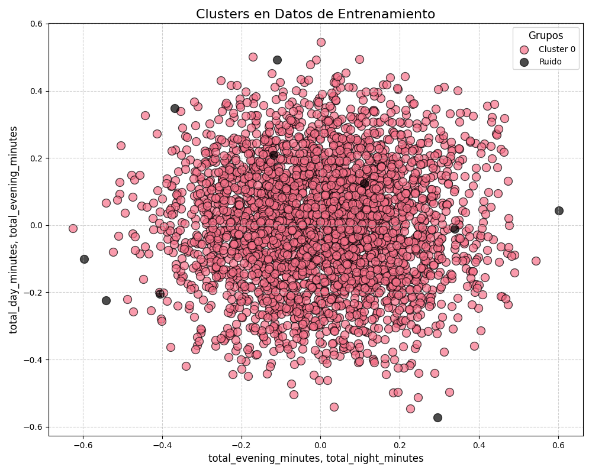
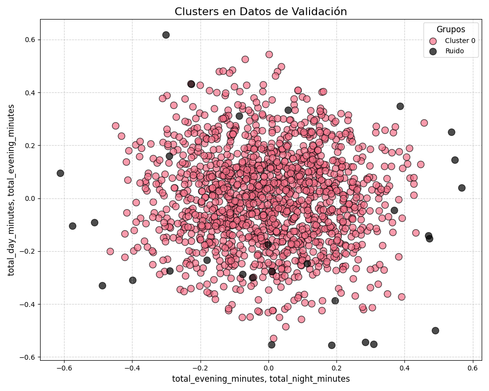
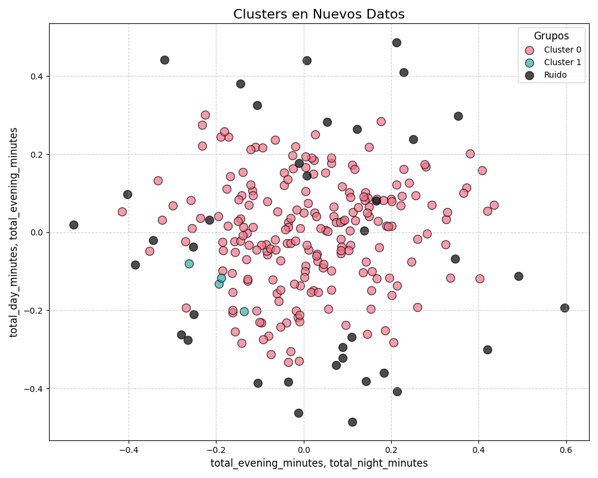

# Informe de Modelo DBSCAN

Este informe detalla los resultados obtenidos en el análisis de clustering, evaluado en datos de entrenamiento, validación y nuevos datos. A continuación, se explican los elementos relevantes del análisis.

## Datos de Entrenamiento

1. **Número de Clusters:**  
   El número total de clusters detectados en el conjunto de datos de entrenamiento.

2. **Puntos Clasificados como Ruido:**  
   Número de puntos que no fueron asignados a ningún cluster y que se consideran ruido en los datos.

3. **Coeficiente de Silueta:**  
   Una métrica que evalúa la calidad del clustering. Los valores oscilan entre -1 y 1, donde valores cercanos a 1 indican que los puntos están bien agrupados en sus clusters, mientras que valores cercanos a -1 sugieren agrupaciones pobres.

4. **Visualización:**  
   Se generó una imagen que muestra la distribución de los clusters en los datos de entrenamiento.
   

---

## Datos de Validación

1. **Número de Clusters:**  
   El número total de clusters detectados en el conjunto de datos de validación.

2. **Puntos Clasificados como Ruido:**  
   Número de puntos en los datos de validación que fueron etiquetados como ruido.

3. **Coeficiente de Silueta:**  
   Métrica que evalúa la calidad de los clusters en los datos de validación. Se utiliza para comparar la estabilidad de los resultados entre entrenamiento y validación.

4. **Visualización:**  
   Se generó una imagen que ilustra los clusters identificados en los datos de validación.

---

## Nuevos Datos

1. **Visualización:**  
   Se generó una imagen con la distribución de clusters en los nuevos datos proporcionados.

2. **Etiquetas:**  
   Las etiquetas de los nuevos datos muestran la cantidad de puntos asignados a cada cluster o clasificados como ruido. Estas etiquetas tienen el siguiente formato:  
   - `-1`: Puntos clasificados como ruido.  
   - `0, 1, ...`: Identificadores de los clusters detectados.  
   Cada etiqueta incluye el número de puntos asociados.

---

## Interpretación General

- El número de clusters y los puntos clasificados como ruido pueden variar entre conjuntos de datos, lo que indica cómo el algoritmo interpreta las estructuras presentes.
- El coeficiente de silueta permite evaluar la calidad del clustering y comparar su estabilidad entre los diferentes conjuntos.
- Las visualizaciones generadas ofrecen una representación gráfica para facilitar la interpretación de los resultados.

Este análisis proporciona una visión integral del desempeño del modelo de clustering en diferentes escenarios y su capacidad para generalizar a nuevos datos.
